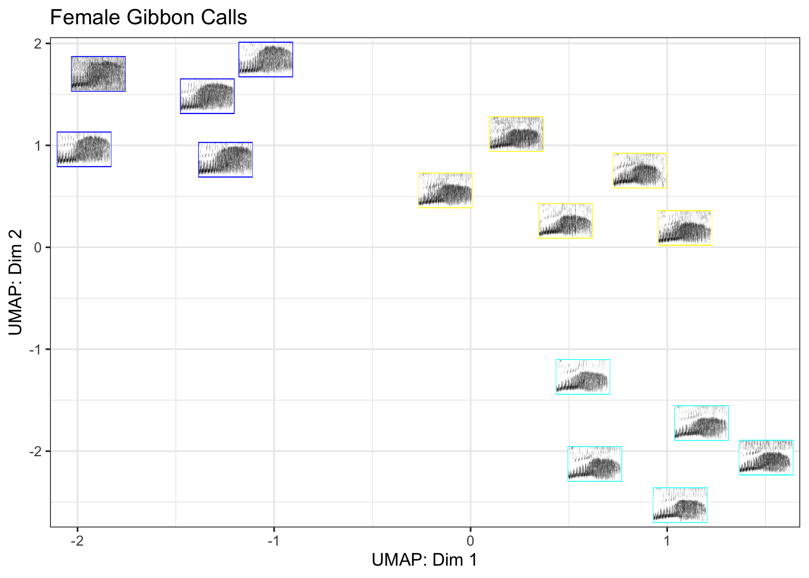

<!-- README.md is generated from README.Rmd. Please edit that file -->

# gibbonID

<!-- badges: start -->

<!-- badges: end -->

The goal of gibbonID is make clustering and visualization of acoustic
data in R easy\! This package is currently under development with a
planned full release later this year (2022).

## Installation

You can install the development version from
[GitHub](https://github.com/DenaJGibbon) with:

``` r
# install.packages("devtools")
devtools::install_github("DenaJGibbon/gibbonID")
```

## Example

This is a basic example which shows you how to create a biplot using
gibbonID. Our dataset consists of different female Northern Gray
gibbons:

``` r
library(gibbonID)
library(ggpubr)

ExampleBiplot <- gibbonID::UMAPBiplotAddSpectrograms(input.dir.Focal="/Users/denaclink/Desktop/RStudio Projects/gibbonID/data/FocalTest",
                          output.dir.Focal = "/Users/denaclink/Desktop/RStudio Projects/gibbonID/data/FocalTest/Thumbnails/",
                          min.freq = 400, max.freq = 1800,main='Female Gibbon Calls')
#> [1] "Creating Spectrograms Step 1 of 3"
#> [1] "/Users/denaclink/Desktop/RStudio Projects/gibbonID/data/FocalTest/Thumbnails/ already exists"
#> [1] "Calculating MFCCs Step 2 of 3"
#> [1] "Adding Spectrograms to Plot Step 3 of 3"
```

``` r
ExampleBiplot 
```


